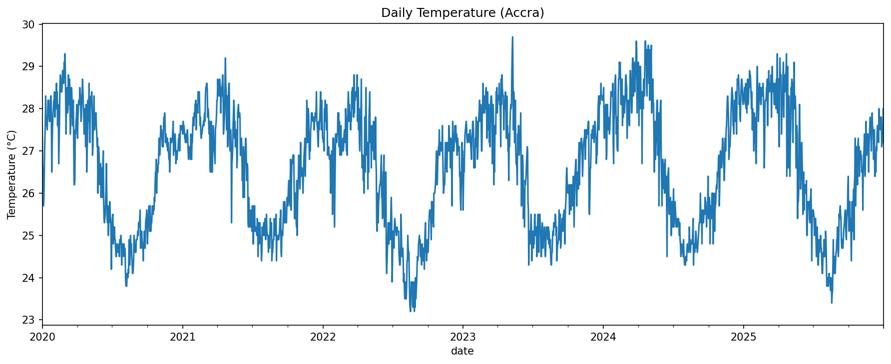
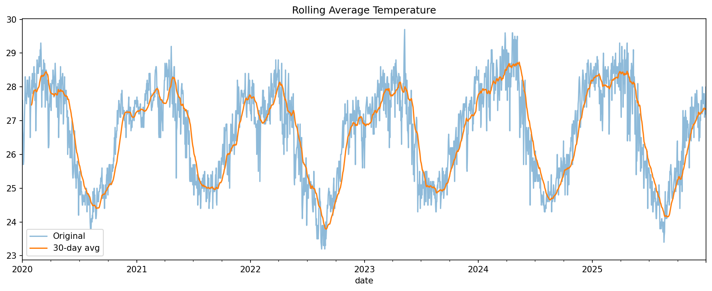
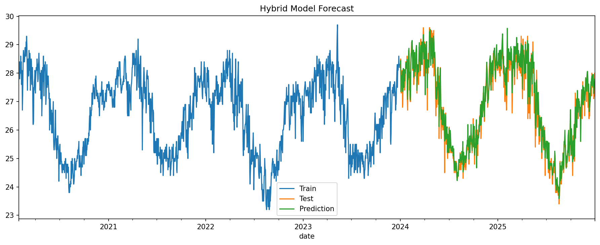
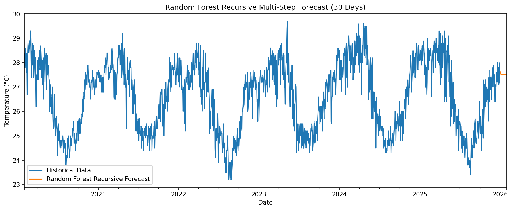

# Weather Time Series Forecasting with SQL

An end-to-end time series project that collects historical weather data for Accra, stores it in SQLite, analyzes it with SQL and pandas, and builds multiple forecasting approaches for daily mean temperature.

## Key Highlights

- Built a reproducible weather pipeline from API extraction to forecast-ready dataset
- Stored and queried time series data in SQLite instead of keeping everything in-memory
- Engineered seasonal, cyclic, lag, and rolling features for forecasting
- Compared deterministic, lag-based, hybrid, and recursive forecasting approaches
- Structured the work as reusable Python scripts rather than a notebook-only analysis

## Visual Snapshot

### Daily Temperature Series



### Rolling Trend



### Forecast Comparison





## Project Summary

This project was built to demonstrate a practical forecasting workflow that goes beyond a single notebook. It combines:

- API-based data collection
- relational storage with SQLite
- SQL-backed querying for analysis
- time-based and lag-based feature engineering
- multiple forecasting strategies ranging from simple interpretable models to richer recursive forecasts

The result is a compact portfolio project that shows data engineering, analytical SQL, exploratory analysis, and classical machine learning for time series in one codebase.

## Dataset

The dataset is collected from the Open-Meteo archive API for:

- City: `Accra`
- Latitude: `5.6037`
- Longitude: `-0.1870`
- Timezone: `Africa/Accra`
- Date range: `2020-01-01` to `2025-12-31`

Current local snapshot:

- Rows: `2192`
- CSV: `data/raw/accra_weather.csv`
- SQLite database: `data/weather.db`
- SQLite table: `weather_daily`

Tracked variables:

- `temperature_2m_mean`
- `temperature_2m_max`
- `temperature_2m_min`
- `precipitation_sum`
- `rain_sum`
- `wind_speed_10m_max`

## Results Snapshot

Current script outputs from the local dataset:

- Deterministic model MAE: `1.435`
- Lag model MAE: `0.207`
- Hybrid model MAE: `0.207`

At the moment, the lag-based and hybrid linear models perform substantially better than the deterministic-only baseline on the implemented holdout split.

## Pipeline Architecture

```text
Open-Meteo API
    -> raw CSV collection
    -> SQLite loading
    -> SQL / pandas querying
    -> feature engineering
    -> model training
    -> multi-step forecasting
```

## Quick Start

Install dependencies:

```bash
pip install -r requirements.txt
```

Run the full workflow from the project root:

```bash
python src/collect_weather.py
python src/load_to_sql.py
python src/features.py
python src/train_deterministic.py
python src/train_lag_model.py
python src/train_hybrid_model.py
python src/forecast_multi_step.py
python src/forecast_recursive.py
```

## Project Structure

```text
weather-time-series-sql/
├── README.md
├── requirements.txt
├── data/
│   ├── raw/
│   │   └── accra_weather.csv
│   └── weather.db
├── models/
├── notebooks/
├── outputs/
├── sql/
│   ├── analysis_queries.sql
│   └── create_tables.sql
└── src/
    ├── collect_weather.py
    ├── db.py
    ├── evaluate.py
    ├── features.py
    ├── features2.py
    ├── forecast.py
    ├── forecast_multi_step.py
    ├── forecast_recursive.py
    ├── load_to_sql.py
    ├── query_data.py
    ├── train_baseline.py
    ├── train_deterministic.py
    ├── train_hybrid_model.py
    └── train_lag_model.py
```

## Workflow

### 1. Collect Historical Weather Data

[src/collect_weather.py](/Users/sylvesterkyeremeh/projects/portfolio/weather-time-series-sql/src/collect_weather.py:1) downloads daily historical weather data from Open-Meteo and saves it as a raw CSV.

Run:

```bash
python src/collect_weather.py
```

### 2. Load Data into SQLite

[src/load_to_sql.py](/Users/sylvesterkyeremeh/projects/portfolio/weather-time-series-sql/src/load_to_sql.py:1) loads the CSV into a local SQLite database.

Run:

```bash
python src/load_to_sql.py
```

### 3. Query and Aggregate the Dataset

[src/query_data.py](/Users/sylvesterkyeremeh/projects/portfolio/weather-time-series-sql/src/query_data.py:1) exposes reusable query functions for:

- full weather history
- monthly aggregated summaries

[src/db.py](/Users/sylvesterkyeremeh/projects/portfolio/weather-time-series-sql/src/db.py:1) handles the database connection.

### 4. Explore the Time Series

[src/features.py](/Users/sylvesterkyeremeh/projects/portfolio/weather-time-series-sql/src/features.py:1) plots:

- the raw daily temperature series
- the 30-day rolling average

Run:

```bash
python src/features.py
```

### 5. Engineer Forecasting Features

[src/features2.py](/Users/sylvesterkyeremeh/projects/portfolio/weather-time-series-sql/src/features2.py:1) builds the forecasting feature set.

Included features:

- calendar features such as month, year, weekday, and day-of-year
- cyclic encodings using sine and cosine transforms
- lag features: `lag_1`, `lag_7`, `lag_30`
- rolling features based on short and medium windows

These features are designed to capture:

- seasonality
- short-term temporal dependence
- smoother local temperature trends

## Forecasting Approaches

The project forecasts daily `temperature_2m_mean` and compares several modeling strategies.

### Deterministic Model

[src/train_deterministic.py](/Users/sylvesterkyeremeh/projects/portfolio/weather-time-series-sql/src/train_deterministic.py:1) uses `statsmodels` `DeterministicProcess` with linear regression to model trend and seasonality.

This is the most interpretable model in the project and serves as a useful baseline for structured seasonal behavior.

Run:

```bash
python src/train_deterministic.py
```

### Lag-Based Regression Model

[src/train_lag_model.py](/Users/sylvesterkyeremeh/projects/portfolio/weather-time-series-sql/src/train_lag_model.py:1) uses lag, rolling, and cyclic features with linear regression.

This adds autoregressive information and gives a stronger feature-based baseline than the deterministic-only model.

Run:

```bash
python src/train_lag_model.py
```

### Hybrid Model

[src/train_hybrid_model.py](/Users/sylvesterkyeremeh/projects/portfolio/weather-time-series-sql/src/train_hybrid_model.py:1) combines:

- deterministic trend and seasonal features
- lag and rolling features

This is the most complete linear model in the repository and reflects the main modeling idea of combining interpretable seasonal structure with autoregressive signals.

Run:

```bash
python src/train_hybrid_model.py
```

### Direct Multi-Step Forecast

[src/forecast_multi_step.py](/Users/sylvesterkyeremeh/projects/portfolio/weather-time-series-sql/src/forecast_multi_step.py:1) trains on the full historical series and produces a 30-day deterministic forecast using out-of-sample features.

Run:

```bash
python src/forecast_multi_step.py
```

### Recursive Forecast

[src/forecast_recursive.py](/Users/sylvesterkyeremeh/projects/portfolio/weather-time-series-sql/src/forecast_recursive.py:1) trains a `RandomForestRegressor` on lag-driven features and forecasts recursively by feeding predictions back into the next step.

This adds a nonlinear forecasting path and shows progression from simple linear time-series models to iterative machine learning forecasting.

Run:

```bash
python src/forecast_recursive.py
```

## Evaluation Strategy

The implemented training scripts use a time-based split:

- training window: before `2024-01-01`
- test window: from `2024-01-01` onward

Current evaluation in the model-training scripts is centered on:

- Mean Absolute Error (`MAE`)

This keeps evaluation aligned with time-series forecasting practice by preserving temporal order instead of using random train/test splits.

## Why This Works as a Portfolio Project

This repository shows more than model fitting. It demonstrates:

- data ingestion from an external API
- local analytical storage with SQL
- reusable query functions
- interpretable and feature-driven forecasting approaches
- clear progression from raw data to multi-step forecast generation

That combination makes it a stronger portfolio piece than a single forecasting notebook.

## Why SQLite Is Part of the Project

SQLite is intentionally part of the stack here. It demonstrates how a forecasting project can include a lightweight storage and query layer rather than treating all work as in-memory pandas only.

That matters for portfolio value because it shows:

- data ingestion into a persistent store
- reusable SQL-backed access patterns
- a clearer separation between raw data, stored data, and modeling code

## Tech Stack

- Python
- pandas
- numpy
- matplotlib
- scikit-learn
- statsmodels
- SQLite
- requests

## Portfolio Notes

This project is strongest as a demonstration of workflow breadth:

- API ingestion
- SQL storage
- analytical querying
- time series feature engineering
- model comparison
- multi-step forecasting

It is less about production deployment and more about showing a clean progression from raw weather data to structured forecasting experiments.

Some files such as `evaluate.py`, `forecast.py`, and `train_baseline.py` appear to be placeholders or unfinished relative to the main implemented path.

## Future Improvements

- save trained models into `models/`
- write forecast charts and prediction outputs into `outputs/`
- add formal backtesting and richer evaluation metrics
- expand the SQL layer with reusable analytical queries
- add rainfall forecasting alongside temperature forecasting
- build a small dashboard or API on top of the forecasting pipeline
